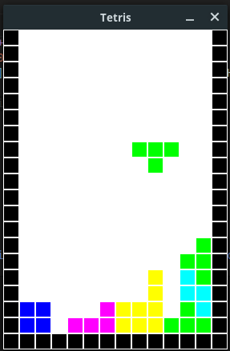

# Tetris

A tetris game made with SDL2. 

<p align="center">
	<a href="">
		
	</a>
</p>

## Prerequisites

Install [meson and ninja](https://mesonbuild.com/Getting-meson.html) to build the project.

The SD2 library too. For those who use fedora 28 like me: 

```bash
$ sudo dnf install SDL2 SLD2-devel SDL2_image SDL2_image-devel
```

For more information, see this [link](https://wiki.libsdl.org/Installation).

How to know if these libraries were installed:

```bash
$ ldconfig -p | grep SDL2 
	libSDL2_image-2.0.so.0 (libc6,x86-64) => /lib64/libSDL2_image-2.0.so.0
	libSDL2-2.0.so.0 (libc6,x86-64) => /lib64/libSDL2-2.0.so.0
```

## Usage

Compile and run

```bash
$ meson build
$ cd build
$ ninja
$ ./src/main
```

## Authors

* **Rafael Coelho** - [rafaellcoellho](https://github.com/rafaellcoellho)

## Reference 

+ [parallelrealities shoot tutorial](https://www.parallelrealities.co.uk/tutorials/#shooter)
+ [javidx9 video](https://www.youtube.com/watch?v=8OK8_tHeCIA&t=695s)